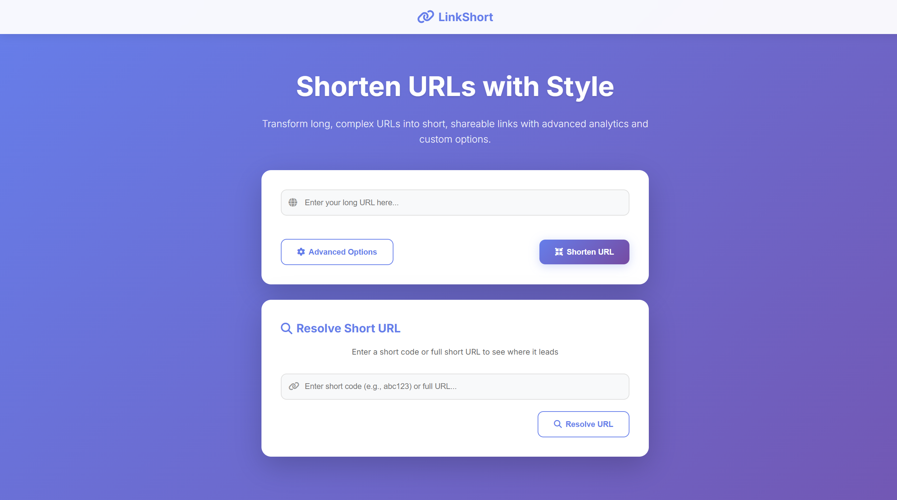

# 🔗 LinkShort - Redis URL Shortener



A modern, high-performance URL shortener built with **Spring Boot** and **Redis**, featuring a sleek web interface and powerful API endpoints.

## ✨ Features

### 🚀 **Core Functionality**
- **URL Shortening**: Transform long URLs into short, shareable links
- **URL Resolution**: Resolve short codes back to original URLs without redirecting
- **Browser Redirection**: Direct link access with automatic redirection
- **Custom Aliases**: Create memorable, branded short links
- **Expiration Control**: Set custom expiration times for links

### 📊 **Analytics & Monitoring** 
- **Real-time Statistics**: Track click counts and access patterns
- **Creation Timestamps**: Monitor when links were created
- **Expiration Tracking**: View remaining time for temporary links
- **Access Analytics**: Detailed insights into link performance

### 🛡️ **Security & Performance**
- **Rate Limiting**: Built-in protection against abuse (configurable limits)
- **Redis Backend**: Lightning-fast data storage and retrieval
- **Input Validation**: Comprehensive URL and alias validation
- **Error Handling**: Robust error management with user-friendly messages

### 🎨 **Modern Interface**
- **Responsive Design**: Works seamlessly on desktop and mobile
- **Interactive UI**: Real-time feedback and smooth animations
- **Dual Functionality**: Both URL shortening and resolution in one interface
- **Copy to Clipboard**: One-click copying of shortened URLs
- **Toast Notifications**: Clear success and error messaging

## 🏗️ **Architecture**

### **Backend Stack**
- **Spring Boot 3.x** - Modern Java framework
- **Redis** - High-performance in-memory database
- **Lombok** - Reduced boilerplate code
- **Swagger/OpenAPI** - API documentation
- **Spring Validation** - Input validation and sanitization

### **Frontend Stack**
- **Vanilla JavaScript** - Modern ES6+ features
- **CSS3** - Advanced styling with gradients and animations
- **Font Awesome** - Professional iconography
- **Responsive Design** - Mobile-first approach

## 🚀 **Quick Start**

### **Prerequisites**
- Java 17 or higher
- Redis Server
- Maven 3.6+

### **1. Clone the Repository**
```bash
git clone https://github.com/yourusername/redis-url-shortener.git
cd redis-url-shortener
```

### **2. Start Redis Server**
```bash
# Using Docker
docker run -d -p 6379:6379 redis:alpine

# Or using Docker Compose
docker-compose up -d redis
```

### **3. Configure Application**
Update `src/main/resources/application.properties`:
```properties
app.base-url=http://localhost:8080
spring.data.redis.host=localhost
spring.data.redis.port=6379
```

### **4. Run the Application**
```bash
mvn spring-boot:run
```

### **5. Access the Interface**
- **Web Interface**: http://localhost:8080
- **API Documentation**: http://localhost:8080/swagger-ui.html
- **Health Check**: http://localhost:8080/api/v1/urls/health

## 🔧 **API Endpoints**

### **Shorten URL**
```http
POST /api/v1/urls
Content-Type: application/json

{
  "url": "https://example.com/very/long/url",
  "customAlias": "my-link",
  "expirationSeconds": 3600
}
```

### **Resolve URL (Browser Redirect)**
```http
GET /{shortCode}
```

### **Get URL Statistics**
```http
GET /api/v1/urls/{shortCode}/stats
```

### **Response Examples**

**Shorten Response:**
```json
{
  "shortUrl": "http://localhost:8080/abc123",
  "originalUrl": "https://example.com/very/long/url",
  "accessCount": 0
}
```

**Statistics Response:**
```json
{
  "shortCode": "abc123",
  "originalUrl": "https://example.com/very/long/url",
  "shortUrl": "http://localhost:8080/abc123",
  "accessCount": 15,
  "createdAt": "2025-07-05T10:30:00",
  "expiresAt": "2025-07-05T11:30:00"
}
```

## 🎯 **Usage Examples**

### **Web Interface**
1. **Shorten URLs**: Enter any URL in the main input field
2. **Advanced Options**: Set custom aliases and expiration times
3. **Resolve URLs**: Use the "Resolve Short URL" section to preview destinations
4. **View Analytics**: Click "View Analytics" to see detailed statistics

### **API Integration**
```javascript
// Shorten a URL
const response = await fetch('/api/v1/urls', {
  method: 'POST',
  headers: { 'Content-Type': 'application/json' },
  body: JSON.stringify({
    url: 'https://example.com',
    customAlias: 'my-link'
  })
});

// Get statistics
const stats = await fetch('/api/v1/urls/my-link/stats');
```

## ⚙️ **Configuration**

### **Rate Limiting**
- **URL Shortening**: 100 requests/minute (configurable)
- **Statistics**: 200 requests/minute (configurable)
- **Per-IP tracking**: Automatic rate limit enforcement

### **Redis Configuration**
```properties
spring.data.redis.host=localhost
spring.data.redis.port=6379
spring.data.redis.password=yourpassword
spring.data.redis.database=0
```

### **Custom Base URL**
```properties
app.base-url=https://yourdomain.com
```

## 🐳 **Docker Deployment**

### **Using Docker Compose**
```bash
docker-compose up -d
```

### **Manual Docker Build**
```bash
docker build -t url-shortener .
docker run -p 8080:8080 --link redis url-shortener
```

## 🧪 **Testing**

### **Run Tests**
```bash
mvn test
```

### **Integration Testing**
```bash
# Test URL shortening
curl -X POST http://localhost:8080/api/v1/urls \
  -H "Content-Type: application/json" \
  -d '{"url":"https://google.com"}'

# Test resolution
curl -X GET http://localhost:8080/api/v1/urls/abc123/stats
```

## 📁 **Project Structure**

```
src/main/java/itawi/url_shortener/
├── builder/           # Response builders
├── config/            # Redis & Swagger configuration
├── controller/        # REST API endpoints
├── dto/              # Data Transfer Objects
├── exception/        # Custom exceptions & handlers
├── service/          # Business logic
└── util/             # Utility classes

src/main/resources/
├── static/           # Web interface files
│   ├── css/         # Stylesheets
│   ├── js/          # JavaScript files
│   └── index.html   # Main page
└── application.properties
```

## 🤝 **Contributing**

1. Fork the repository
2. Create a feature branch (`git checkout -b feature/amazing-feature`)
3. Commit your changes (`git commit -m 'Add amazing feature'`)
4. Push to the branch (`git push origin feature/amazing-feature`)
5. Open a Pull Request

## 📄 **License**

This project is licensed under the MIT License - see the [LICENSE](LICENSE) file for details.

## 🔗 **Links**

- **API Documentation**: http://localhost:8080/swagger-ui.html
- **Issues**: [GitHub Issues](https://github.com/yourusername/redis-url-shortener/issues)

---

**Built with ❤️ using Spring Boot & Redis**
