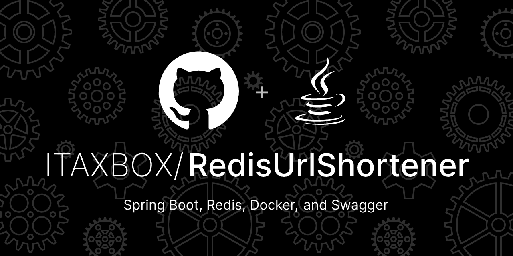

# URL Shortener Project

## Overview

The **URL Shortener** project is a simple and efficient web application built using Spring Boot, Redis, and Docker. It provides endpoints to:

- Shorten URLs.
- Resolve shortened URLs to their original form.
- Retrieve access statistics for shortened URLs.

The application includes rate limiting to prevent abuse and uses **SpringDoc OpenAPI** for interactive API documentation.

---

## Features

- **URL Shortening**:
  - Users can shorten long URLs.
  - Optional custom aliases can be provided.
  - Expiration times can be set for shortened URLs.

- **URL Resolution**:
  - Users can resolve shortened URLs to their original URLs.
  - The application redirects to the original URL.

- **Statistics Retrieval**:
  - Users can retrieve access statistics for shortened URLs, including the number of times a shortened URL has been accessed.

- **Rate Limiting**:
  - Rate limiting is implemented to prevent abuse of the API endpoints.
  - Users are limited to a certain number of requests per minute.

- **API Documentation**:
  - Interactive API documentation is provided using **SpringDoc OpenAPI**.
  - Users can explore and test the API endpoints via **Swagger UI**.

---

## Prerequisites

Before you begin, ensure you have the following installed:

- **Java 21**: [Download Java 21](https://openjdk.java.net/projects/jdk/21/)
- **Maven**: [Download Maven](https://maven.apache.org/)
- **Docker**: [Download Docker](https://www.docker.com/get-started)

---

## Getting Started

### Local Setup

1. **Clone the Repository**:
    ```bash
    git clone https://github.com/ITAXBOX/RedisUrlShortener.git
    cd RedisUrlShortener
    ```

2. **Build the Project**:
    ```bash
    mvn clean install
    ```

3. **Run Redis Locally**:
   Ensure Redis is running locally on port `6379`. You can use Docker to run Redis:
    ```bash
    docker run --name redis-container -d -p 6379:6379 redis
    ```

4. **Run the Application**:
    ```bash
    mvn spring-boot:run
    ```

5. **Access the Application**:
   Open a web browser and navigate to:  
   [http://localhost:8080](http://localhost:8080)

---

### Docker Setup

1. **Clone the Repository**:
    ```bash
    git clone https://github.com/ITAXBOX/RedisUrlShortener.git
    cd RedisUrlShortener
    ```

2. **Build the Docker Images**:
    ```bash
    docker-compose build
    ```

3. **Run the Docker Containers**:
    ```bash
    docker-compose up
    ```

4. **Access the Application**:
   Open a web browser and navigate to:  
   [http://localhost:8080](http://localhost:8080)

---

## API Documentation

The API documentation is available via **Swagger UI**. Once the application is running, you can access it at:  
[http://localhost:8080/swagger-ui/index.html](http://localhost:8080/swagger-ui/index.html)


---


## Contributing

Contributions are welcome! Please follow these steps to contribute:

1. **Fork the Repository**:
  - Fork the repository on GitHub.

2. **Create a Feature Branch**:
    ```bash
    git checkout -b feature/AmazingFeature
    ```

3. **Commit Your Changes**:
    ```bash
    git commit -m "Add AmazingFeature"
    ```

4. **Push to the Branch**:
    ```bash
    git push origin feature/AmazingFeature
    ```

5. **Open a Pull Request**:
  - Open a pull request to the main branch.

---

## License

This project is licensed under the **MIT License** - see the [LICENSE](LICENSE) file for details.